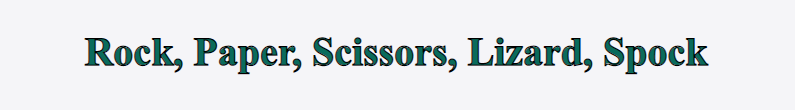
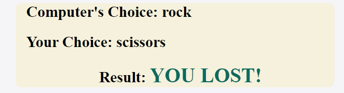

# Rock, Paper, Scissors, Lizard, Spock
This game is an extended version of the popular Rock, Paper, Scissors game. Rules are simple: Scissors cuts paper, paper covers rock, rock crushes lizard, lizard poisons Spock, Spock smashes scissors, scissors decapitates lizard, lizard eats paper, paper disproves Spock, Spock vaporizes rock, and as it always has, rock crushes scissors. After the user chooses one of 5 options, the Computer randomly chooses second option, and the game tells us who is the winner.

## Features

### Heading
- The name of the game is written in Heading area
- Font is dark green with black outline on white background

### Button area
- There are 5 interactive buttons as possible choices for user
- Buttons are photos of emojis of human hands, formed like Rock, Paper, Scissors, Lizard or Spock
- When hovered over, the button changes the font size and cursor becomes a pointer for better understanding

### Result area
- In the result area we can see which option user chose, which option the computer chose as well as who is the winner.
- Background colour is light beige, while the winner is written with uppercase in dark green colour so it is easier to spot it

## Credits

## Content
Code for [Rock, Paper, Scissors](https://github.com/kubowania/rock-paper-scissors-x3/tree/main/rock-paper-scissors-examples/rock-paper-scissors-example-1) game was taken from [Kubowania](https://github.com/kubowania) user on GitHub

## Media
Emoji buttons were taken from [Get Emoji](https://getemoji.com/)
